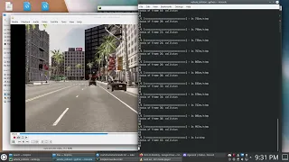

# CSC 5100 Intro to Mobility - Final Project

Harrison Lavins

Parteek Bindra

## Purpose

The goal of this project is to predict if a vehicle is in a dangerous situation where it will find itself in an imminent collision using the CARLA simulator, OpenCV, and TensorFlow deep learning framework.

## Results

_Result Demo Video: [https://youtu.be/\_f2_wACyEGM](https://youtu.be/_f2_wACyEGM)_

## References

- Python 3.7
- TensorFlow 2.0
- [OpenCV Python](https://docs.opencv.org/4.x/index.html)
- CARLA 0.9.13 [About CARLA](https://carla.org/)
- Utilities and examples modified from the [CARLA Python API](https://carla.readthedocs.io/en/latest/)
- Model architecture and utilities referenced from [https://github.com/perseus784/Vehicle_Collision_Prediction_Using_CNN-LSTMs](https://github.com/perseus784/Vehicle_Collision_Prediction_Using_CNN-LSTMs)
